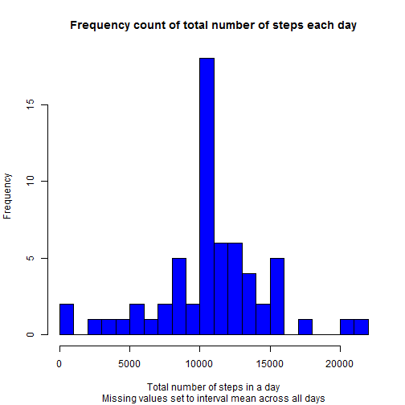

## Aim

This report investigates Activity Monitoring data and reports on the mean
and median number of steps taken per day (with a histogram used to visualise
the spread of data across days).

I identified the 5-minute interval in the day that has (on average) the
most number of steps taken, also visualised via a time series plot.

I then account for missing values (replacing them with a suitable 
substitute) and then explore the mean, median and spread via a histogram. I
will then comment on the impact of imputing the missing values.

Finally, I compare the activity patterns between weekends and weekdays.

## Loading and preprocessing the data

I first read the zip file; note that specifying the number of rows and the
column classes will speed up data reading. Missing values are coded as NA


```r
data <- read.csv(unz("activity.zip", "activity.csv"), nrows=17568, header=TRUE, quote="\"", sep=",", na.strings = "NA", colClasses = c("numeric", "Date", "numeric"))
```

## Mean and Median total number of steps taken per day

I calculate the total number of steps taken each day.

To do this, I split the data using Date for grouping, and for each group 
(i.e., each day), I calculate the total steps taken, ignoring NA values.


```r
total_steps <- sapply(split(data$steps,data$date), sum, na.rm=TRUE)
```

I can then visualise the frequency of the number of steps taken over all days
using a historgram; I use breaks=20 makes the historgram more granular


```r
hist(total_steps, xlab="Total number of steps in a day", breaks=20, 
     col="blue", main="Frequency count of total number of steps each day",
     sub="Missing values ignored")
```

 

I can then calculate the mean and median total number of steps per day.

Mean total steps per day:

```r
mean(total_steps)
```

```
## [1] 9354.23
```

Median total steps per day:

```r
median(total_steps)
```

```
## [1] 10395
```

## Average daily activity pattern

I calculate the average number of steps taken each interval in the day.

To do this, I split the data using Interval for grouping, and for each 
group (i.e., each interval), I calculate the mean steps taken, 
ignoring NA values. Using lapply, the result is a list with each element
set to a number (mean) and with the name of each element set to the 
interval name. I can then create a dataset with the intervals and the 
averages and rename the columns of the dataset to make it readable.


```r
avg_steps_list <- lapply(split(data$steps,data$interval), mean, na.rm=TRUE)
avg_steps_data <- data.frame(names(avg_steps_list), unlist(avg_steps_list), stringsAsFactors=FALSE)
names(avg_steps_data)[1]<-paste("interval")
names(avg_steps_data)[2]<-paste("mean_steps")
rm(avg_steps_list)
```

I can plot the daily activity with intervals in the X axis and average 
steps across all days in the Y axis to get a feel for where the most
number of steps are taken.


```r
plot(avg_steps_data$interval, avg_steps_data$mean_steps, type="l",
     col="blue", main="Average steps by daily interval",
     xlab="Daily interval", ylab="Avg. steps across all days")
```

 

It seems like most number of steps are taken around 8:30AM.
To confirm, I calculate the interval with the highest mean and return
the corresponding interval.

The interval where the most number of steps are taken (averaged across
all days) is:


```r
avg_steps_data[which.max(avg_steps_data$mean_steps),]$interval
```

```
## [1] "835"
```

## Imputing missing values

First, I calculate the number of missing values in each column of the 
dataset.

The number of missing values in 'steps' column is:


```r
sum(is.na(data$steps))
```

```
## [1] 2304
```

Looking for missing values in the 'date' and 'interval' columns,


```r
sum(is.na(data$date))
```

```
## [1] 0
```

```r
sum(is.na(data$interval))
```

```
## [1] 0
```

There seem to be no missing dates or intervals.

I will replace missing values in the steps column with the average
number of steps across all days for that interval corresponding to the
missing value.

I have already calculated the lookup dataset that will give us the 
average across all days for the interval. I will first convert it into
a function (rounding the mean to the nearest integer) that I can call.


```r
fn_mean_step <- function(i) {round(avg_steps_data[avg_steps_data$interval 
                                                  == i,2])}
```

I can then get the vector of intervals corresponding to steps that have 
a missing value for, and overwrite the number of steps with the mean 
steps across all days corresponding to that interval (rounded to an integer)


```r
data[is.na(data$steps),1] <- sapply(as.character((data[is.na(data$steps),3])), fn_mean_step)
```

I then repeat the above process calculating total daily steps, without
removing missing values (as there should be none)


```r
total_steps_no_na <- sapply(split(data$steps,data$date), sum)
```

I can then repeat the visualisation of the frequency of the number of 
steps taken over all days using a historgram; again, I use breaks=20 makes 
the historgram more granular.


```r
hist(total_steps_no_na, xlab="Total number of steps in a day", breaks=20,
     col="blue", main="Frequency count of total number of steps each day", 
     sub="Missing values set to interval mean across all days")
```

 

I can then calculate the mean and median total number of steps per day.

Mean total steps per day (missing values replaced by interval mean):

```r
mean(total_steps_no_na)
```

```
## [1] 10765.64
```

Median total steps per day (missing values replaced by interval mean):

```r
median(total_steps_no_na)
```

```
## [1] 10762
```

## Impact of imputing missing values

When missing values are imputed, the ~6,000 missing values (that would
otherwise have not been counted and therefore spiked the 0/NA column)
are now spread across the other step counts, increasing the median and
average number of steps in a day. The bars in the histogram also get
narrower suggesting that values that could otherwise be outliers are
now being counted as the average.

## Differences in activity patterns between weekdays and weekends

Calculate a new factor variable set to "weekend" or "weekday" depending on
whether the date falls on a weekend or not (respectively) and add it to
the dataset.


```r
data$wkday <- factor(ifelse(weekdays(data$date) %in% c("Saturday", "Sunday"),
    "weekend","weekday"))
```

I first load the lattice library (install if it does not exist) and then
create a two panel plot showing the average number of steps (y-axis) by
interval (x-axis)

I create a new dataset with the average number of steps grouped by weekday
vs. weekend and then by the interval.

I then plot the average steps by daily interval, split by weekend vs. 
weekday.


```r
if (!require(lattice)) install.packages(lattice);
```

```
## Loading required package: lattice
```

```r
summ_data <- aggregate(data$steps, by=list(data$wkday, data$interval),FUN=mean)

names(summ_data)[1]<-paste("is_weekend")
names(summ_data)[2]<-paste("day_interval")
names(summ_data)[3]<-paste("avg_steps")

xyplot(avg_steps ~ day_interval | is_weekend, data=summ_data, 
       type="l", layout=c(1,2),
       main="Avg. steps by interval - Weekday vs. Weekend", 
       ylab="Average Number of Steps", xlab="Intra-day Interval")
```

 

For weekdays, most steps are done in the morning between 0800 and 0930, 
with only minor peaks at other times (noticeably one around ~6pm).
For weekends, though, it is more distributed through the day (between 0800
to abour 1930).

